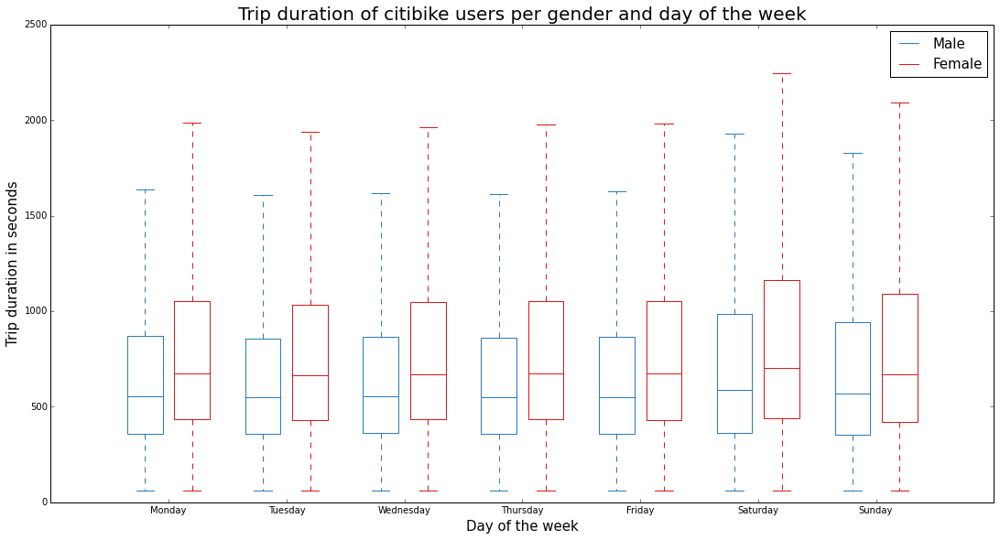

CLARITY: It is easy to read.
         It is clear, and easy to know the relationship of duration of male and female.
         Therefore, it is a little difficult to read the difference between each day's duration of each gender.

ESTHETIC: I like the colors, however, it is easier to read if the boxes are colored by the colors of lines.
          Otherwise draw with thicker outlines, to make the graph easier to read.
          
          It will be a problem, if a reader is color blind, so it should be better to use different style lines or                   different thickness lines.
          Graphical choices are allowing me to focus on the right elements.

HONESTY: The plot is honestly reproducing the data.
