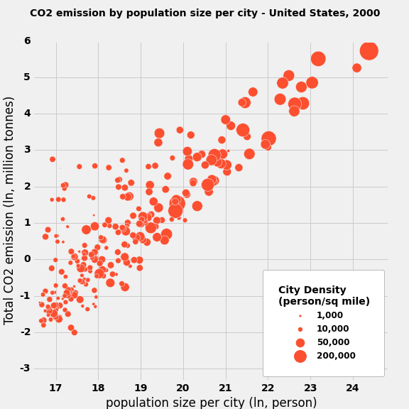

CLARITY: The plot is easy to read. The quantities are visualized ambiguous.

ESTHETIC:It is perfect. The colors are chosen appropriately and bright. The graphical elements are used appropriate to represent the quantities being visualized. The graphical choices are allowing you to focus on the right elements.

HONESTY: The plot is deforming it, so it is easy to find out the density. 
